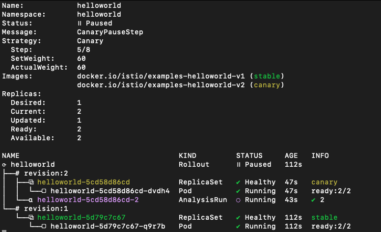
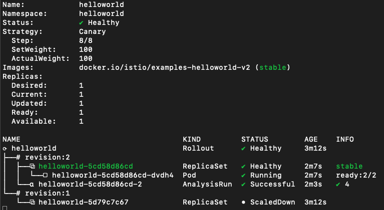

# Orchestrating advanced Applications Deployments across multiple Kubernetes clusters with Istio, ArgoCD, and Argo Rollouts

<p align="center">
## Contributors
</p>

[Edu Bonilla](https://www.linkedin.com/in/eduardo-bonilla-rodriguez-8868b8181/)                |  [Fran Perea](https://www.linkedin.com/in/francisco-perea-rodr%C3%ADguez-a3ba74105/)
:-------------------------:|:-------------------------:
  |  

This lab will consist on one mgmt cluster which will be named the hub cluster, in which we will have argoCD hub running.

We will have two workload clusters, in which we will install istio in multicluster primary-primary mode; each of the will have the helloworld-v1 application.

The purpose of this lab is making a canary upgrade of our helloword application from v1 to v2, using argocd rollouts. Both workload clusters will be sharing traffic, and rollouts will be consuming metrics of a federated prometheus on the mgmt cluster. 

So both apps deployed in workload clusters will perform the canary upgrade at the same time consuming same metrics in a multi-cluster approach.


## Deploy clusters

For deploying our clusters, we have a sample script for deploying eks managed clusters with eksctl, you can run create-eks-cluster.sh script in parent folder of the repo.

You must install one hub cluster, which will be the mgmt one:

```bash
./create-eks-cluster.sh -n argo-hub -t mesh-mgmt
```

And two workload clusters which will contain the istio installation and resources, the apps and the rollouts:

```bash
./create-eks-cluster.sh -n argo-rollout1 -t mesh-workload
./create-eks-cluster.sh -n argo-rollout2 -t mesh-workload
```

## Install Istio Multi-Cluster

In our case we have installed istio Multi-Primary on different networks, following istio [docs](https://istio.io/latest/docs/setup/install/multicluster/multi-primary_multi-network/)

Please don't forget to [verify you installation](https://istio.io/latest/docs/setup/install/multicluster/verify/) deploying sample apps and making sure that you are able to reach both workload clusters from any of them.

## Install ArgoCD and ArgoCD Rollouts

Install and configure ArgoCD in the _hub_ cluster and register both _cluster-1_ and _cluster-2_ workload clusters.

```bash
export CTX_CLUSTER1=argo-rollout1
export CTX_CLUSTER2=argo-rollout2
export CTX_CLUSTERHUB=argo-hub
```

### ArgoCD: Hub Cluster

First, install ArgoCD in the _hub_ cluster:
```bash
kubectl --context="${CTX_CLUSTERHUB}" create namespace argocd
kubectl --context="${CTX_CLUSTERHUB}" apply -n argocd -f https://raw.githubusercontent.com/argoproj/argo-cd/stable/manifests/install.yaml
```

Expose Argo Server:
```
kubectl patch svc argocd-server -n argocd -p '{"spec": {"type": "LoadBalancer"}}'
```

Login using Argo CLI:
```bash
argocd admin initial-password -n argocd
ARGOHUB=$(kubectl get svc argocd-server -n argocd -o json | jq -r .status.loadBalancer.ingress\[\].ip)
argocd login $ARGOHUB --insecure
```

Register both workloads clusters in ArgoCD:
```bash
argocd cluster add $CTX_CLUSTER1
argocd cluster add $CTX_CLUSTER2
```

### Argo Rollouts: Workload clusters

Install kubectl plugin: [Kubectl Plugin](https://argoproj.github.io/argo-rollouts/installation/#kubectl-plugin-installation).

Install Argo Rollout in both workload clusters:
```bash
kubectl --context="${CTX_CLUSTER1}" create namespace argo-rollouts
kubectl --context="${CTX_CLUSTER1}" apply -n argo-rollouts -f https://github.com/argoproj/argo-rollouts/releases/latest/download/install.yaml
kubectl --context="${CTX_CLUSTER2}" create namespace argo-rollouts
kubectl --context="${CTX_CLUSTER2}" apply -n argo-rollouts -f https://github.com/argoproj/argo-rollouts/releases/latest/download/install.yaml
```

## Deploy Application Sets

For deploying our sample application, which will be helloworld-v1, we have an applicationSet. 

```bash
k apply -f argo-resources/application-set/appset-helloworld.yaml
```

This will just deploy two services for our helloworld namespace, as the pod itself will be automatically deployed when we deploy the rollout:

```bash
% k1 get svc -n helloworld
helloworld          ClusterIP   10.100.198.8    <none>        5000/TCP   16d
helloworld-canary   ClusterIP   10.100.181.48   <none>        5000/TCP   16d
```

First service will serve helloworld-v1 and helloworld-canary will be used for helloworld-v2 when we deploy the rollout.

Also we will deploy the neccessary istio resources for making this to work.

```bash
k apply -f istio-resources/application-set/appset-istio-resources.yaml
```

Here we will deploy a VirtualService:

```bash
apiVersion: networking.istio.io/v1beta1
kind: VirtualService
metadata:
  labels:
    app.kubernetes.io/instance: kube-agent1-istio-resources
  name: helloworld-crosscluster-gateways
  namespace: helloworld
spec:
  gateways:
  - istio-system/ingressgateway
  hosts:
  - '*'
  http:
  - match:
    - sourceLabels:
        app: istio-ingressgateway
        istio: ingressgateway
      uri:
        prefix: /hello
    name: helloworld
    route:
    - destination:
        host: helloworld
        port:
          number: 5000
      weight: 100
    - destination:
        host: helloworld-canary
        port:
          number: 5000
      weight: 0
```

Which will reference a weight 100 for helloworld svc and 0 for helloworld-canary, these weights will change when we deploy the rollout. Also we will deploy a gateway object for traffic coming into the cluster:

```bash
apiVersion: networking.istio.io/v1beta1
kind: Gateway
metadata:
  labels:
    app.kubernetes.io/instance: kube-agent1-istio-resources
  name: ingressgateway
  namespace: istio-system
spec:
  selector:
    istio: ingressgateway
  servers:
  - hosts:
    - '*'
    port:
      name: http
      number: 80
      protocol: HTTP
```

From our previous installation of istio multicluster we should also have an east-west gateway already deployed for multicluster communication:

```bash
apiVersion: networking.istio.io/v1beta1
kind: Gateway
metadata:
  name: cross-network-gateway
  namespace: istio-system
spec:
  selector:
    istio: eastwestgateway
  servers:
  - hosts:
    - '*.local'
    port:
      name: tls
      number: 15443
      protocol: TLS
    tls:
      mode: AUTO_PASSTHROUGH
```

## Deploy the monitoring stack

For the rollouts to be processed, we will point to a unique entry point of information.

For achieving this, we will deploy a Prometheus Operator per workload cluster, and Thanos in the hub cluster. 

We will federate thanos scraping metrics from both Prometheus Operators and query thanos from our Rollouts Deployments, so that both canary dpeloyments are upgraded with the same information.

### Deploy Prometheus Operator on Workload Clusters

We will use [Bitnami](https://bitnami.com) helm charts to deploy out stack, so let's add the chart repository:

```bash
helm repo add bitnami https://charts.bitnami.com/bitnami 
```
We have good documentation of how to this this in [bitnami docs](https://docs.bitnami.com/tutorials/create-multi-cluster-monitoring-dashboard-thanos-grafana-prometheus/#step-2-install-and-configure-thanos), but I will also document step by step here documenting the problems I have faced for this singular case.

We will deploy one Prometheus Operator for each workload cluster. In each workload cluster we will change the externalLabel of the cluster, so for workload cluster1 we can use _data-producer-1_ and for workload cluster2 we can use _data-producer-2_

```bash
helm install --context="${CTX_CLUSTER1}" prometheus-operator \
  --set prometheus.thanos.create=true \
  --set operator.service.type=ClusterIP \
  --set prometheus.service.type=ClusterIP \
  --set alertmanager.service.type=ClusterIP \
  --set prometheus.thanos.service.type=LoadBalancer \
  --set prometheus.externalLabels.cluster="data-producer-1" \
  bitnami/kube-prometheus

helm install --context="${CTX_CLUSTER2}" prometheus-operator \
  --set prometheus.thanos.create=true \
  --set operator.service.type=ClusterIP \
  --set prometheus.service.type=ClusterIP \
  --set alertmanager.service.type=ClusterIP \
  --set prometheus.thanos.service.type=LoadBalancer \
  --set prometheus.externalLabels.cluster="data-producer-2" \
  bitnami/kube-prometheus
```

This helm Chart will deploy Prometheus Operator along side with a Thanos sidecar that will export the metrics to our principal Thanos in the Hub.

```bash
kubectl get svc --context="${CTX_CLUSTER1}" | grep prometheus-operator-prometheus-thanos
kubectl get svc --context="${CTX_CLUSTER2}" | grep prometheus-operator-prometheus-thanos
```

### Install and Configure Thanos

For installing and configuring thanos on the Hub Cluster, we will use the file we have located at monitoring/values.yaml in the repo:

```bash
cat values.yaml
objstoreConfig: |-
  type: s3
  config:
    bucket: thanos
    endpoint: {{ include "thanos.minio.fullname" . }}.monitoring.svc.cluster.local:9000
    access_key: minio
    secret_key: KEY
    insecure: true
querier:
  stores:
    - SIDECAR-SERVICE-IP-ADDRESS-1:10901
    - SIDECAR-SERVICE-IP-ADDRESS-2:10901
bucketweb:
  enabled: true
compactor:
  enabled: true
storegateway:
  enabled: true
ruler:
  enabled: true
  alertmanagers:
    - http://prometheus-operator-alertmanager.monitoring.svc.cluster.local:9093
  config: |-
    groups:
      - name: "metamonitoring"
        rules:
          - alert: "PrometheusDown"
            expr: absent(up{prometheus="monitoring/prometheus-operator"})
minio:
  enabled: true
  accessKey:
    password: "minio"
  secretKey:
    password: "KEY"
  defaultBuckets: "thanos"
```

We have noticed that there is a bug in the values.yaml file, as you are supposed to change the KEY value and set you preferred password. However thanos is being installed always with the same user and random password. So what we will do is installing Thanos in Hub Cluster:

```bash
helm install thanos bitnami/thanos -n monitoring \
  --values values.yaml
```

And you will see that _thanos-storegateway-0_ pod is having the following error:

```bash
The access key ID you provided does not exist in our records
```

This is because the values for thanos password in values.yaml file are not being taken, because a random password has been generated and the pod is not able to access with proper credentials.

For getting the actual password you would need to check it with the following command:

```bash
k get secret -n monitoring thanos-minio -o yaml -o jsonpath={.data.root-password} | base64 -d
```

Substitute this password by KEY in your values.yaml file, and upgrade the helm chart:

```bash
helm upgrade thanos bitnami/thanos -n monitoring \
  --values values.yaml
```

You should see all the pods ap and running now. You can verify the status of the sidecar Thanos endpoints from the UI in _Stores_ tab:

```bash
k port-forward -n monitoring svc/thanos-query 9090
```


### Install and Configure Grafana

Use the following command to install Grafana on the Hub cluster:

```bash
helm install grafana bitnami/grafana \
  --set service.type=LoadBalancer \
  --set admin.password=GRAFANA-PASSWORD --namespace monitoring
```

Once the pod is up and running, access Grafana from the UI and add Prometheus as _Data Source_ with the following URL:

```bash
http://thanos-query.monitoring.svc.cluster.local:9090
```

Click Save and Test and you should get a message in green saying that Data source is working.

Now you can import Grafana Dashboards to view the scraped metrics, this step is not necessary but it is good for testing everything was done ok.

We recommend you ading the open source istio grafana dashboards, if you import them at this moment you won't be able to see any metrics, but when you complete next step, you can come back and test.

### Add PodMonitor and ServiceMonitor to scrape Istio Metrics

We have added in this repo a file with the necessary PodMonitor and ServiceMonitor you will need for scrapping istio metrics from workload clusters.

You just have to apply the yaml in both workload clusters in the namespace in which the Prometheus Operator is running:

```bash
kubectl apply -f monitoring/monitor.yaml --context="${CTX_CLUSTER1}"
kubectl apply -f monitoring/monitor.yaml --context="${CTX_CLUSTER2}"
```

Now please generate some load on your istio applications, and test that you are recieving metrics.

If you check on thanos, you should be able to run some queries such as _istio_requests_total_:


You can also visualize metrics from Grafana:


## Upgrade your Application with Argo Rollouts

For upgrading our application, we will deploy a new ApplicationSet which consists of two Rollouts.

For applying it, execute the following command:

```bash
k apply -f argo-resources/rollout/appset-rollouts.yaml
```

You can check they have been created in both workload clusters:

```bash
% k1 get rollout -A
NAMESPACE    NAME         DESIRED   CURRENT   UP-TO-DATE   AVAILABLE   AGE
helloworld   helloworld   1         1         1            1           54s
% k2 get rollout -A
NAMESPACE    NAME         DESIRED   CURRENT   UP-TO-DATE   AVAILABLE   AGE
helloworld   helloworld   1         1         1            1           57s
```

If you want to check the context of the files, they consist on a rollout and an analysisTemplate.

The analysisTemplate will measure that we are getting more than 90% of request with 200 response_code for the new version:

```bash
apiVersion: argoproj.io/v1alpha1
kind: AnalysisTemplate
metadata:
  name: istio-success-rate
  namespace: helloworld
spec:
  # this analysis template requires a service name and namespace to be supplied to the query
  args:
  - name: service
  - name: namespace
  metrics:
  - name: success-rate
    initialDelay: 60s
    interval: 20s
    successCondition: result[0] > 0.90
    provider:
      prometheus:
        address: http://a4c66330e34cc41cdb7cadf2f7ede153-1169737763.us-east-1.elb.amazonaws.com:9090
        query: >+
          sum(irate(istio_requests_total{
            reporter="source",
            destination_service=~"helloworld-canary.helloworld.svc.cluster.local",
            response_code!~"5.*"}[40s])
          )
          /
          sum(irate(istio_requests_total{
            reporter="source",
            destination_service=~"helloworld-canary.helloworld.svc.cluster.local"}[40s])
          )
```

FOr the rollout, we have the following file:

```bash
apiVersion: argoproj.io/v1alpha1
kind: Rollout
metadata:
  name: helloworld
  namespace: helloworld
spec:
  selector:
    matchLabels:
      app: helloworld
      service: helloworld
  template:
    metadata:
      labels:
        app: helloworld
        service: helloworld
    spec:
      containers:
      - name: helloworld
        image: docker.io/istio/examples-helloworld-v1
        ports:
        - name: http
          containerPort: 5000
          protocol: TCP
      serviceAccountName: helloworld
  strategy:
    canary:
      # analysis will be performed in background, while rollout is progressing through its steps
      analysis:
        startingStep: 1   # index of step list, of when to start this analysis
        templates:
        - templateName: istio-success-rate
        args:             # arguments allow AnalysisTemplates to be re-used
        - name: service 
          value: helloworld-canary
        - name: namespace
          valueFrom:
            fieldRef:
              fieldPath: metadata.namespace
      canaryService: helloworld-canary
      stableService: helloworld 
      trafficRouting:
        istio:
          virtualService:
            name: helloworld-crosscluster-gateways
            routes:
            - helloworld
      steps:
      - setWeight: 10
      - pause: {duration: 20s}         # pause indefinitely
      - setWeight: 20
      - pause: {duration: 20s}
      - setWeight: 30
      - pause: {duration: 20s}
      - setWeight: 40
      - pause: {duration: 20s}
      - setWeight: 50
      - pause: {duration: 20s}
      - setWeight: 60
      - pause: {duration: 20s}
      - setWeight: 70
      - pause: {duration: 20s}
      - setWeight: 80
      - pause: {duration: 20s}
      - setWeight: 90
      - pause: {duration: 20s}
```

In this file, we specify that we will start with v1 of our helloworld application, and that we will use the service helloworld-canary for the new version of our application v2. We also specify the analysisTemplate to use and the VirtualService, as well as the weights for the different steps.

This will also deploy helloworld-v1 in both workload clusters, for testing you can make several calls to any of the Ingress Gateways of any workload cluster and you should see that the request hits helloworld-v1 in cluster1 and helloworld-v1 in cluster2. 

```
% curl http://amazon-svc.us-east-1.elb.amazonaws.com/hello
Hello version: v1, instance: helloworld-5d79c7c67-jhc4x
% curl http://amazon-svc.us-east-1.elb.amazonaws.com/hello
Hello version: v1, instance: helloworld-5d79c7c67-9pzmt
```

Make sure that the pods are deployed correctly if you don't get any traffic:
```bash
% k1 get po -n helloworld
NAME                         READY   STATUS    RESTARTS   AGE
helloworld-5d79c7c67-xr8ll   2/2     Running   0          6m31s
% k2 get po -n helloworld
NAME                         READY   STATUS    RESTARTS   AGE
helloworld-5d79c7c67-9lcsw   2/2     Running   0          6m39s
```

Once we reach this point, we are ready to start the rollout, so let's execute the following command to follow it up in the workload clusters:

```bash
% kubectl argo rollouts get rollout helloworld -n helloworld --watch
Name:            helloworld
Namespace:       helloworld
Status:          ✔ Healthy
Strategy:        Canary
  Step:          18/18
  SetWeight:     100
  ActualWeight:  100
Images:          docker.io/istio/examples-helloworld-v1 (stable)
Replicas:
  Desired:       1
  Current:       1
  Updated:       1
  Ready:         1
  Available:     1

NAME                                   KIND        STATUS     AGE    INFO
⟳ helloworld                           Rollout     ✔ Healthy  9m42s  
└──# revision:1                                                      
   └──⧉ helloworld-5d79c7c67           ReplicaSet  ✔ Healthy  9m42s  stable
      └──□ helloworld-5d79c7c67-xr8ll  Pod         ✔ Running  9m42s  ready:2/2
```

The idea of our setup now, is to make a change into the version of the rollout and commit change. This will trigger that the ApplicationSet defined in out mgmt cluster will notice that change and start the rollout of both remote clusters at exactly the same time, as we have only a single rollout that is spread across clusters thanks to the ApplicationSet. Also, as the analysisTemplate is taking the metrics from the mgmt cluster where we have the metrics federated, the VirtualService will also be changed at the same time in both workload clusters.

So let's change the version of our helloworld application with the following command:

```bash
sed -i 's/-v1/-v2/g' argo-resources/rollout/strategy/rollout.yaml
```

The only thing that would change would be the image in the spec:
```bash
    spec:
      containers:
      - name: helloworld
        image: docker.io/istio/examples-helloworld-v2
```

We just have to subbmit the changes in our github for making ArgoCD reconcile, depending on your Argo strategy you might need to sync your ApplicationSet:

```bash
git add argo-resources/rollout/strategy/rollout.yaml
git commit -m "upgrade app to version v2"
git push
```

Once sync, you will see that the Rollout is progressing, and if you check the command I provided before, you should see a green tick if everyhting is going well:



You can also check the VirtualService to see if the weights are changing:

```bash
apiVersion: networking.istio.io/v1beta1
kind: VirtualService
metadata:
  labels:
    app.kubernetes.io/instance: kube-agent1-istio-resources
  name: helloworld-crosscluster-gateways
  namespace: helloworld
spec:
  gateways:
  - istio-system/ingressgateway
  hosts:
  - '*'
  http:
  - match:
    - sourceLabels:
        app: istio-ingressgateway
        istio: ingressgateway
      uri:
        prefix: /hello
    name: helloworld
    route:
    - destination:
        host: helloworld
        port:
          number: 5000
      weight: 40
    - destination:
        host: helloworld-canary
        port:
          number: 5000
      weight: 60
```

When the roolout finishes, you will have something like this:



And every call you make will be forwarded to v2 version of applications in both workload clusters:

```bash
Hello version: v2, instance: helloworld-5cd58d86cd-w4c2q
Hello version: v2, instance: helloworld-5cd58d86cd-dvdh4
Hello version: v2, instance: helloworld-5cd58d86cd-w4c2q
Hello version: v2, instance: helloworld-5cd58d86cd-dvdh4
Hello version: v2, instance: helloworld-5cd58d86cd-w4c2q
Hello version: v2, instance: helloworld-5cd58d86cd-dvdh4
Hello version: v2, instance: helloworld-5cd58d86cd-w4c2q
Hello version: v2, instance: helloworld-5cd58d86cd-dvdh4
```

So we have managed to upgrade our Application in real time at the same time with the same metrics in multiple clusters using Istio, Thanos, ArgoCD and Rollouts!

Everything Open Source!

