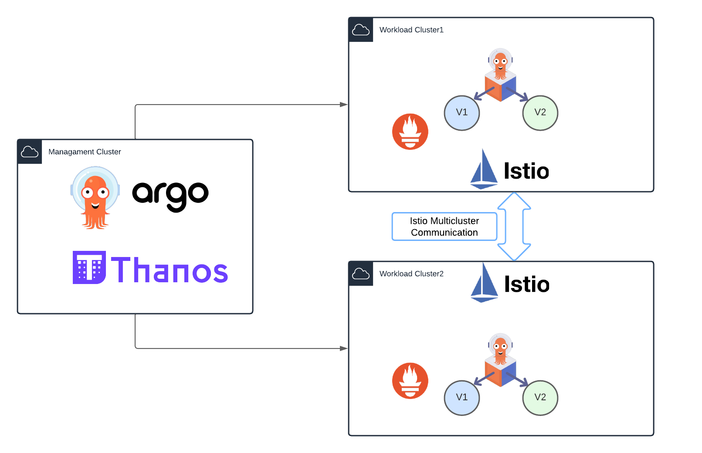
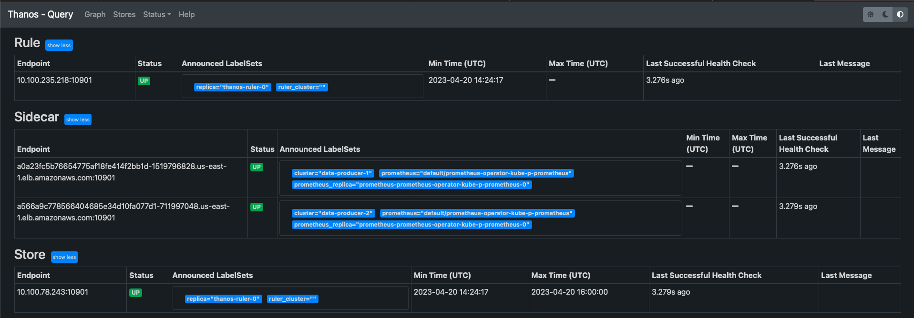
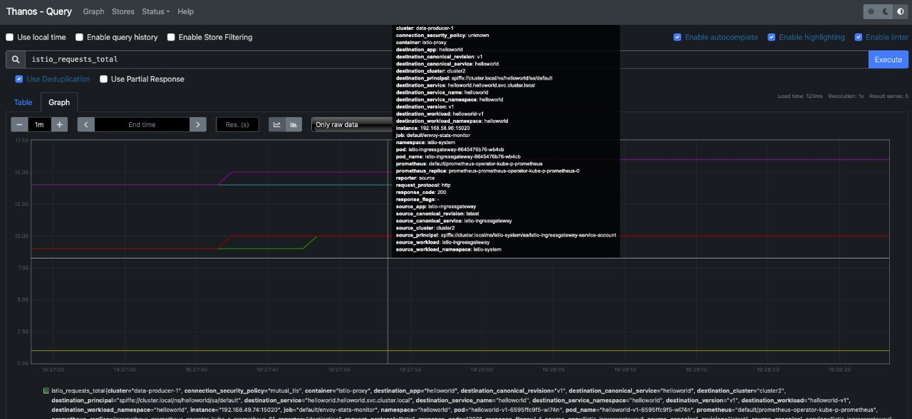
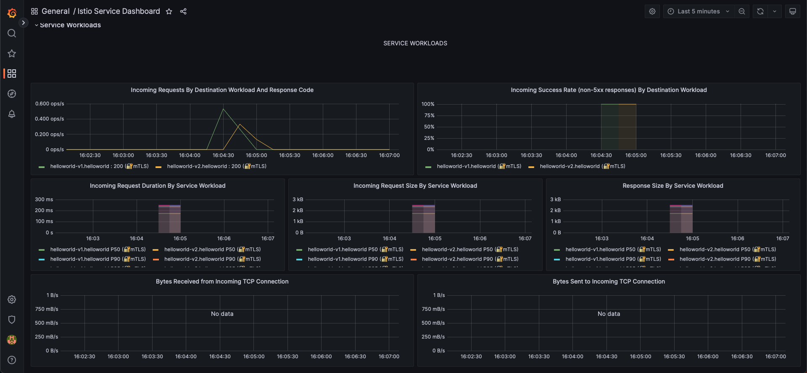

# Multicluster-Canary

:mag: The _main_ branch of this repository uses AWS as Cloud Provider. Switch to _k8s-kvm_ branch to deploy the same lab in KVM

This lab will consist on one mgmt cluster which will be named the hub cluster, in which we will have argoCD hub running.

We will have two workload clusters, in which we will install istio in multicluster primary-primary mode; each of the will have the helloworld-v1 application.

The purpose of this lab is making a canary upgrade of our helloword application from v1 to v2, using argocd rollouts. Both workload clusters will be sharing traffic, and rollouts will be consuming metrics of a federated prometheus on the mgmt cluster. 

So both apps deployed in workload clusters will perform the canary upgrade at the same time consuming same metrics in a multi-cluster approach.



## Deploy clusters

For deploying our clusters, we have a sample script for deploying eks managed clusters with eksctl, you can run create-eks-cluster.sh script in parent folder of the repo.

You must install one hub cluster, which will be the mgmt one:

```bash
./create-eks-cluster.sh -n argo-hub -t mesh-mgmt
```

And two workload clusters which will contain the istio installation and resources, the apps and the rollouts:

```bash
./create-eks-cluster.sh -n argo-rollout1 -t mesh-workload
./create-eks-cluster.sh -n argo-rollout2 -t mesh-workload
```

## Install Istio Multi-Cluster

In our case we have installed istio Multi-Primary on different networks, following istio [docs](https://istio.io/latest/docs/setup/install/multicluster/multi-primary_multi-network/)

Please don't forget to [verify you installation](https://istio.io/latest/docs/setup/install/multicluster/verify/) deploying sample apps and making sure that you are able to reach both workload clusters from any of them.

## Install ArgoCD and ArgoCD Rollouts

Install and configure ArgoCD in the _hub_ cluster and register both _cluster-1_ and _cluster-2_ workload clusters.

```bash
export CTX_CLUSTER1=argo-rollout1
export CTX_CLUSTER2=argo-rollout2
export CTX_CLUSTERHUB=argo-hub
```

### ArgoCD: Hub Cluster

First, install ArgoCD in the _hub_ cluster:
```bash
kubectl --context="${CTX_CLUSTERHUB}" create namespace argocd
kubectl --context="${CTX_CLUSTERHUB}" apply -n argocd -f https://raw.githubusercontent.com/argoproj/argo-cd/stable/manifests/install.yaml
```

Expose Argo Server:
```
kubectl patch svc argocd-server -n argocd -p '{"spec": {"type": "LoadBalancer"}}'
```

Login using Argo CLI:
```bash
argocd admin initial-password -n argocd
ARGOHUB=$(kubectl get svc argocd-server -n argocd -o json | jq -r .status.loadBalancer.ingress\[\].ip)
argocd login $ARGOHUB --insecure
```

Register both workloads clusters in ArgoCD:
```bash
argocd cluster add $CTX_CLUSTER1
argocd cluster add $CTX_CLUSTER2
```

### Argo Rollouts: Workload clusters

Install kubectl plugin: [Kubectl Plugin](https://argoproj.github.io/argo-rollouts/installation/#kubectl-plugin-installation).

Install Argo Rollout in both workload clusters:
```bash
kubectl --context="${CTX_CLUSTER1}" create namespace argo-rollouts
kubectl --context="${CTX_CLUSTER1}" apply -n argo-rollouts -f https://github.com/argoproj/argo-rollouts/releases/latest/download/install.yaml
kubectl --context="${CTX_CLUSTER2}" create namespace argo-rollouts
kubectl --context="${CTX_CLUSTER2}" apply -n argo-rollouts -f https://github.com/argoproj/argo-rollouts/releases/latest/download/install.yaml
```

## Deploy Application Sets

## Deploy the monitoring stack

For the rollouts to be processed, we will point to a unique entry point of information.

For achieving this, we will deploy a Prometheus Operator per workload cluster, and Thanos in the hub cluster. 

We will federate thanos scraping metrics from both Prometheus Operators and query thanos from our Rollouts Deployments, so that both canary dpeloyments are upgraded with the same information.

### Deploy Prometheus Operator on Workload Clusters

We will use [Bitnami](https://bitnami.com) helm charts to deploy out stack, so let's add the chart repository:

```bash
helm repo add bitnami https://charts.bitnami.com/bitnami 
```
We have good documentation of how to this this in [bitnami docs](https://docs.bitnami.com/tutorials/create-multi-cluster-monitoring-dashboard-thanos-grafana-prometheus/#step-2-install-and-configure-thanos), but I will also document step by step here documenting the problems I have faced for this singular case.

We will deploy one Prometheus Operator for each workload cluster. In each workload cluster we will change the externalLabel of the cluster, so for workload cluster1 we can use _data-producer-1_ and for workload cluster2 we can use _data-producer-2_

```bash
helm install --context="${CTX_CLUSTER1}" prometheus-operator \
  --set prometheus.thanos.create=true \
  --set operator.service.type=ClusterIP \
  --set prometheus.service.type=ClusterIP \
  --set alertmanager.service.type=ClusterIP \
  --set prometheus.thanos.service.type=LoadBalancer \
  --set prometheus.externalLabels.cluster="data-producer-1" \
  bitnami/kube-prometheus

helm install --context="${CTX_CLUSTER2}" prometheus-operator \
  --set prometheus.thanos.create=true \
  --set operator.service.type=ClusterIP \
  --set prometheus.service.type=ClusterIP \
  --set alertmanager.service.type=ClusterIP \
  --set prometheus.thanos.service.type=LoadBalancer \
  --set prometheus.externalLabels.cluster="data-producer-2" \
  bitnami/kube-prometheus
```

This helm Chart will deploy Prometheus Operator along side with a Thanos sidecar that will export the metrics to our principal Thanos in the Hub.

```bash
kubectl get svc --context="${CTX_CLUSTER1}" | grep prometheus-operator-prometheus-thanos
kubectl get svc --context="${CTX_CLUSTER2}" | grep prometheus-operator-prometheus-thanos
```

### Install and Configure Thanos

For installing and configuring thanos on the Hub Cluster, we will use the file we have located at monitoring/values.yaml in the repo:

```bash
cat values.yaml
objstoreConfig: |-
  type: s3
  config:
    bucket: thanos
    endpoint: {{ include "thanos.minio.fullname" . }}.monitoring.svc.cluster.local:9000
    access_key: minio
    secret_key: KEY
    insecure: true
querier:
  stores:
    - SIDECAR-SERVICE-IP-ADDRESS-1:10901
    - SIDECAR-SERVICE-IP-ADDRESS-2:10901
bucketweb:
  enabled: true
compactor:
  enabled: true
storegateway:
  enabled: true
ruler:
  enabled: true
  alertmanagers:
    - http://prometheus-operator-alertmanager.monitoring.svc.cluster.local:9093
  config: |-
    groups:
      - name: "metamonitoring"
        rules:
          - alert: "PrometheusDown"
            expr: absent(up{prometheus="monitoring/prometheus-operator"})
minio:
  enabled: true
  accessKey:
    password: "minio"
  secretKey:
    password: "KEY"
  defaultBuckets: "thanos"
```

We have noticed that there is a bug in the values.yaml file, as you are supposed to change the KEY value and set you preferred password. However thanos is being installed always with the same user and random password. So what we will do is installing Thanos in Hub Cluster:

```bash
helm install thanos bitnami/thanos -n monitoring \
  --values values.yaml
```

And you will see that _thanos-storegateway-0_ pod is having the following error:

```bash
The access key ID you provided does not exist in our records
```

This is because the values for thanos password in values.yaml file are not being taken, because a random password has been generated and the pod is not able to access with proper credentials.

For getting the actual password you would need to check it with the following command:

```bash
k get secret -n monitoring thanos-minio -o yaml -o jsonpath={.data.root-password} | base64 -d
```

Substitute this password by KEY in your values.yaml file, and upgrade the helm chart:

```bash
helm upgrade thanos bitnami/thanos -n monitoring \
  --values values.yaml
```

You should see all the pods ap and running now. You can verify the status of the sidecar Thanos endpoints from the UI in _Stores_ tab:

```bash
k port-forward -n monitoring svc/thanos-query 9090
```


### Install and Configure Grafana

Use the following command to install Grafana on the Hub cluster:

```bash
helm install grafana bitnami/grafana \
  --set service.type=LoadBalancer \
  --set admin.password=GRAFANA-PASSWORD --namespace monitoring
```

Once the pod is up and running, access Grafana from the UI and add Prometheus as _Data Source_ with the following URL:

```bash
http://thanos-query.monitoring.svc.cluster.local:9090
```

Click Save and Test and you should get a message in green saying that Data source is working.

Now you can import Grafana Dashboards to view the scraped metrics, this step is not necessary but it is good for testing everything was done ok.

We recommend you ading the open source istio grafana dashboards, if you import them at this moment you won't be able to see any metrics, but when you complete next step, you can come back and test.

### Add PodMonitor and ServiceMonitor to scrape Istio Metrics

We have added in this repo a file with the necessary PodMonitor and ServiceMonitor you will need for scrapping istio metrics from workload clusters.

You just have to apply the yaml in both workload clusters in the namespace in which the Prometheus Operator is running:

```bash
kubectl apply -f monitoring/monitor.yaml --context="${CTX_CLUSTER1}"
kubectl apply -f monitoring/monitor.yaml --context="${CTX_CLUSTER2}"
```

Now please generate some load on your istio applications, and test that you are recieving metrics.

If you check on thanos, you should be able to run some queries such as _istio_requests_total_:



You can also visualize metrics from Grafana:


